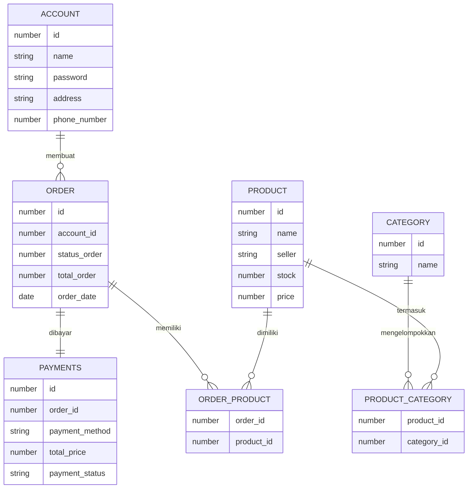

**ACCOUNT dan ORDER**
Satu akun bisa membuat banyak order, dan satu order hanya dibuat oleh satu akun.

**ORDER dan PAYMENTS**
Satu order hanya dapat dibayar oleh satu payment dan satu payment hanya dapat membayar satu order

**ORDER dan ORDER_PRODUCT**
Satu order dapat memiliki banyak product.

**PRODUCT dan ORDER_PRODUCT**
Satu product dapat dimiliki banyak order.

**CATEGORY dan PRODUCT_CATEGORY**
Satu category menggelompokan banyak product.

**PRODUCT dan PRODUCT_CATEGORY**
Satu product mempunyai banyak category.