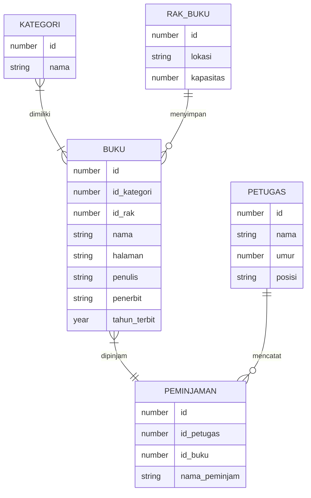

**KATEGORI dan BUKU**
Satu kategori bisa dimiliki oleh banyak buku, dan satu buku dapat memiliki banyak kategori.

**RAK_BUKU dan BUKU**
Satu rak bisa menyimpan banyak buku, tapi satu buku hanya disimpan di satu rak.

**BUKU dan PEMINJAMAN**
Satu buku hanya dapat dipinjam satu dalam satu waktu, dan satu catatan peminjaman dapat meminjam satu atau lebih buku.

**PETUGAS dan PEMINJAMAN**
Satu petugas bisa mencatat banyak peminjaman, tapi satu peminjaman hanya dicatat oleh satu petugas.
